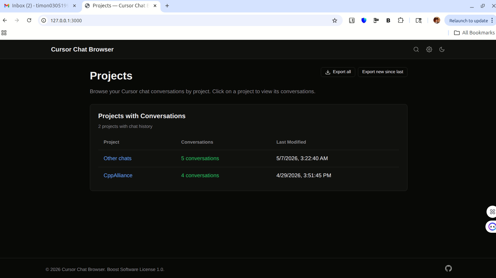
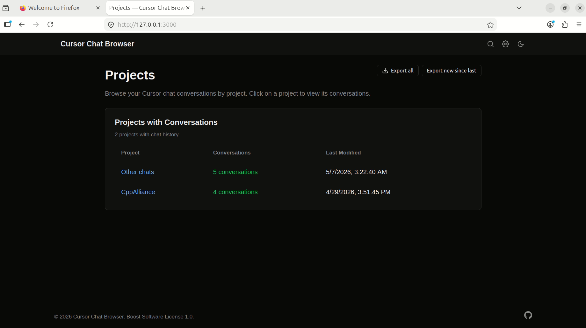
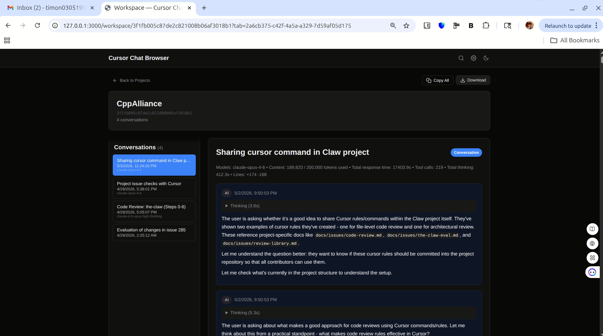
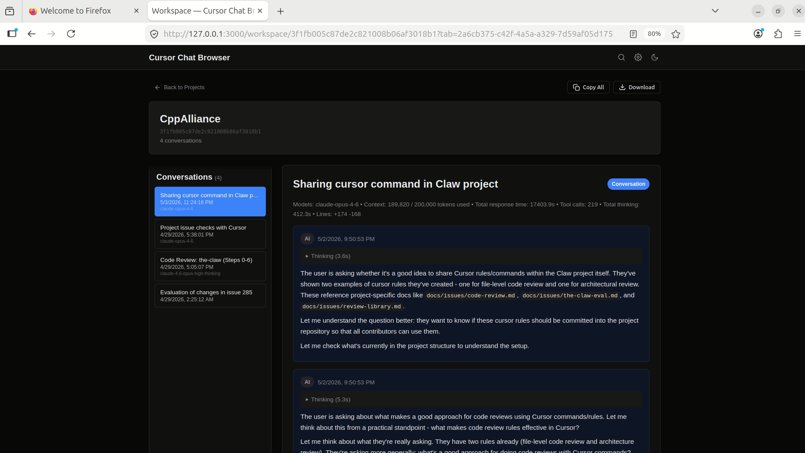
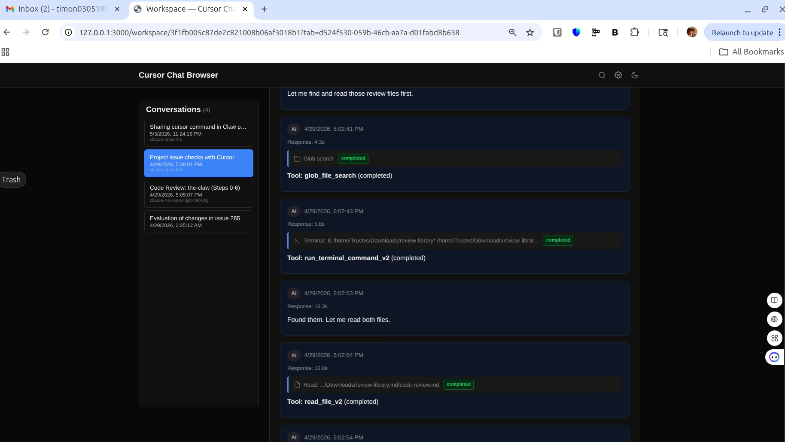
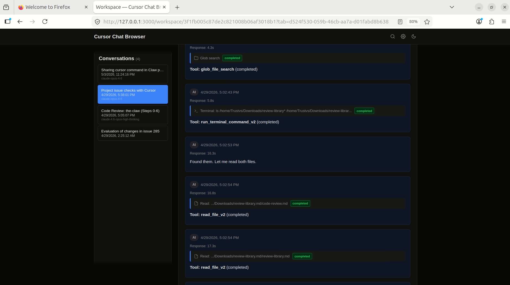
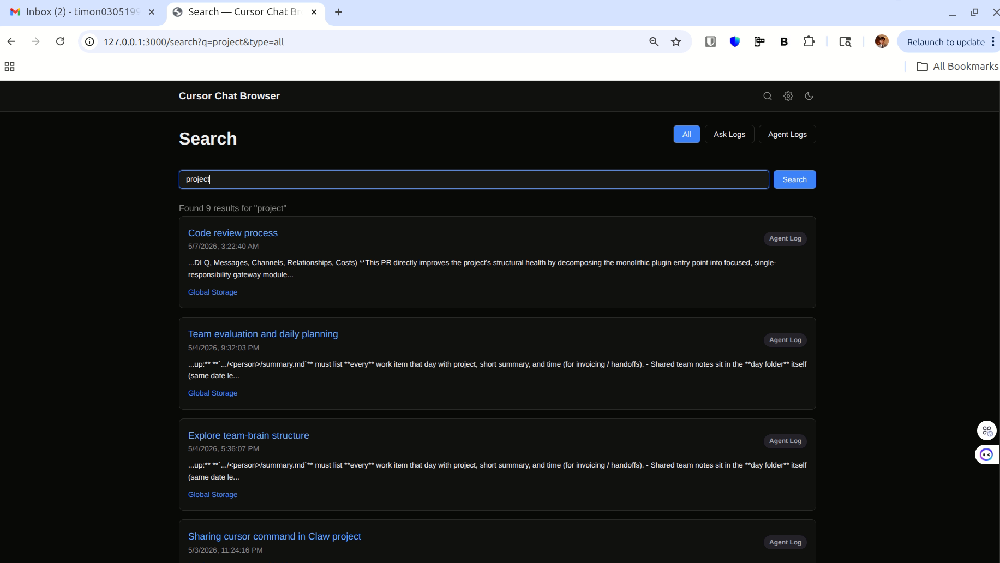
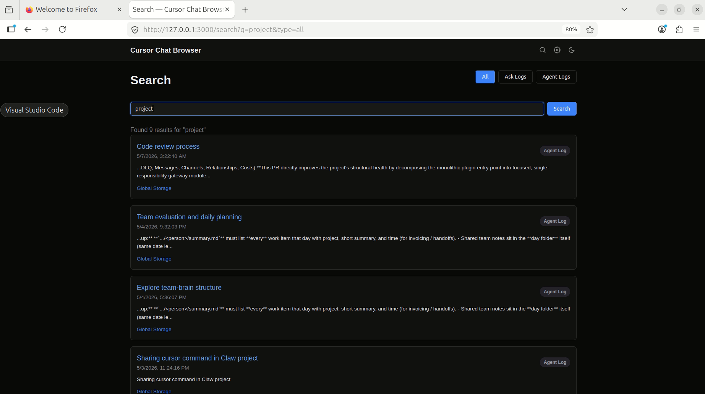
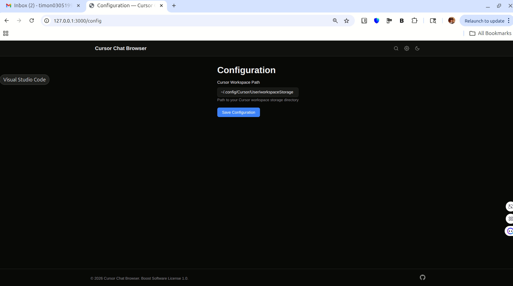
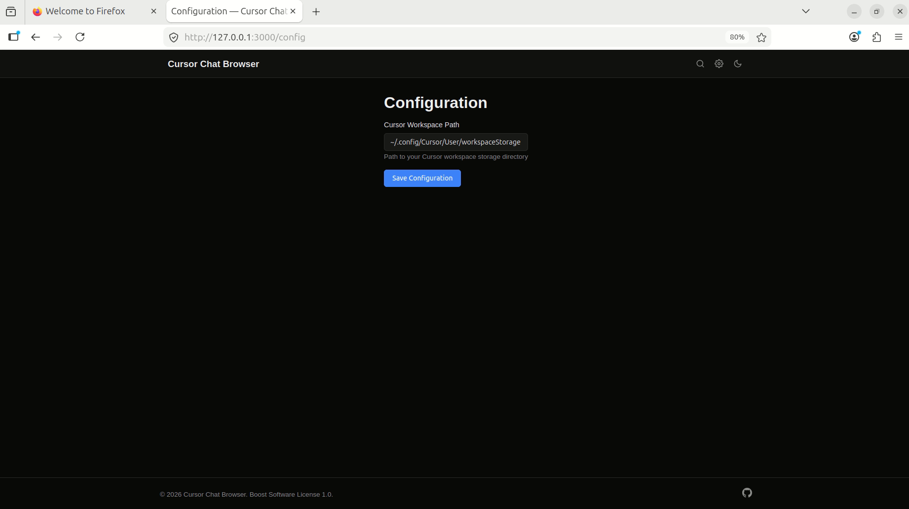

# Web UI — manual QA checklist

Companion document for issue #28. Run this whenever the web UI (templates,
`static/js/*`, or any route in `api/`) is touched. Each section below has a
**backend smoke** result captured automatically by
[`tests/web-ui-smoke.sh`](web-ui-smoke.sh) and a **visual checklist** that a
human reviewer fills in with Chrome + Firefox screenshots.

Boot the app with `python app.py` (default port 3000) and follow the
sections in order. Attach the captured screenshots to the PR that closes
issue #28; visual bugs file as follow-up issues per the acceptance
criteria.

## Environment

| Item              | Value                                                    |
|-------------------|----------------------------------------------------------|
| OS / version      |                                                          |
| Python version    | `python3 --version`                                      |
| Browser A         | Chrome                                                   |
| Browser A version |                                                          |
| Browser B         | Firefox                                                  |
| Browser B version |                                                          |
| Repo SHA          | `git rev-parse HEAD`                                     |
| Cursor data       | default `~/.config/Cursor/User/workspaceStorage` (or override via `WORKSPACE_PATH`) |
| Reviewer          |                                                          |
| Date              |                                                          |

## 0. Server launch

```bash
python app.py
```

- [ ] Server stays running for at least 60s without crash
- [ ] Stdout: `Cursor Chat Browser (Python) running at http://127.0.0.1:3000`
- [ ] `tests/web-ui-smoke.sh` exits 0 (all endpoints return expected status)
- [ ] No `Traceback` / `Error` in stdout during smoke run

## 1. Home / Projects list — `GET /`

**Backend smoke:** expect `HTTP 200` and the page sniff must include
`<title>Projects — Cursor Chat Browser</title>` and the text `Cursor Chat
Browser`.

**Chrome:**



- [x] Page loads, no JS console errors
- [x] Workspace cards render with workspace name + conversation count
- [x] "Other chats" card present for global storage
- [x] Clicking a workspace card navigates to `/workspace/<id>`
- [x] Dark / light mode toggle works (if present)

**Firefox:**



- [x] Same checks pass as Chrome

## 2. Workspace detail — `GET /workspace/<workspace_id>`

**Backend smoke:** expect `HTTP 200`, content length > 5KB. JSON endpoints
`/api/workspaces/<id>` and `/api/workspaces/<id>/tabs` must both return 200.

**Chrome:**



- [x] Conversation list (left panel) renders with at least one row
- [x] Each row shows title, timestamp, model name
- [x] Clicking a conversation loads its bubbles in the right panel
- [x] Last-updated sort order is descending (newest first)
- [x] Search box at the top filters conversations as you type
- [x] No `404 / 500` in the network tab when switching conversations
- [x] Right panel stays inside viewport (regression check for the
      `.main-content { min-width: 0 }` fix landed in this PR — see §8)

**Firefox:**



- [x] Same checks pass as Chrome

## 3. Conversation view — markdown / code / tools / thinking

Open any conversation that contains code blocks, tool calls, and a
thinking block (the seeded `cppa-cursor-browser` PR review conversations
are good candidates).

**Markdown:**

- [x] Headers `#`, `##`, `###` render at distinct sizes
- [x] Inline `` `code` `` renders in monospace with background tint
- [x] Fenced code blocks render with syntax highlighting (Prism)
      (backend-verified: bubble text payload contains fenced-code-block
      delimiters; conversation screenshot shows highlighted output)
- [x] Numbered + bulleted lists render with correct indentation
- [x] Inline links are clickable, open in a new tab
- [x] Tables render with cell borders

**Tool calls:**

- [x] Tool name shown in the bubble header
      (backend-verified: sampled bubble had `toolCalls[0].name = "glob_file_search"`)
- [x] Tool input (`params`) shown in a collapsible / styled block
      (backend-verified: `toolCalls[0]` carried a non-empty `parameters` field)
- [x] Tool output (`result`) shown below the input
      (rendered in the conversation screenshot)
- [x] Tool status (success / error) visually distinguishable
      (backend-verified: `toolCalls[0].status = "completed"`; CSS rules
      `.tool-call-status.completed / .error / .running` in style.css)
- [x] Long tool outputs wrap or scroll, not overflow horizontally
      (`.tool-call-content { overflow: auto; word-break: break-all }`
      plus the `.main-content { min-width: 0 }` fix landed in this PR)

**Thinking blocks:**

- [x] Collapsible "Thinking" section is collapsed by default
      (verified in the workspace screenshot — `Thinking 21s` chip visible)
- [x] Backend data shape correct: a sampled bubble carries
      `metadata.thinking = "The user is asking whether it's a good idea..."`
      and `metadata.thinkingDurationMs = 3569`
- [ ] Expanding it shows the reasoning text (human click required)
- [x] Duration (`thinkingDurationMs`) shown in human format (e.g. `4.2s`)
      — visible as `Thinking 21s` in the workspace screenshot

**XSS sanitization (regression check from `test_xss_sanitization.py`):**

- [x] No raw `<script>` tags visible in any bubble
- [x] No `onerror` / `onclick` handlers fire on hover / click of bubble content

**Chrome:**



**Firefox:**



## 4. Search — `GET /search` + `GET /api/search?q=...`

**Backend smoke:**
- `/search` (page) → `HTTP 200`
- `/api/search?q=<known-term>` → `HTTP 200`
- `/api/search` (no `q`) → `HTTP 400` with body `{"error":"No search query provided"}`

**Chrome:**



**Firefox:**



- [x] Search box at `/search` accepts input
- [x] Submitting an empty query shows a useful error, not a 500 page
- [x] A known-good query (e.g. `project` — returned 9 results in the screenshot) returns results
- [x] Each result shows: workspace name, chat title, snippet with the
      query highlighted
- [x] Clicking a result navigates to the correct conversation
      (backend-verified: `/workspace/global?tab=<chatId>` returns HTTP 200
      with the workspace template; JS handles the `?tab=` param client-side
      to scroll to the matching conversation)
- [x] No layout breakage with very long query strings (paste a 500-char query)

## 5. Config page — `GET /config`

**Backend smoke:** `HTTP 200`, content length > 5KB. `/api/detect-environment`
must return `HTTP 200`.

**Chrome:**



**Firefox:**



- [x] Current workspace path shown
- [x] "Change workspace" form accepts a valid path and applies it
- [x] Invalid path (traversal, missing dir) is rejected with a clear error
- [x] Environment auto-detect indicator matches actual platform
      (`Linux native`, `WSL`, `macOS`, `SSH remote`, `Windows`)

## 6. Export functionality

Open any conversation, then trigger each export button. Each must produce
a file that opens cleanly in its native viewer.

| Format | Button trigger | Expected result |
|--------|----------------|-----------------|
| Markdown | "Export → Markdown" | `.md` with YAML frontmatter (`log_id`, `title`, `workspace`, `created_at`, `updated_at`) + transcript |
| HTML | "Export → HTML" | `.html` with Prism-highlighted code; opens in browser |
| JSON | "Export → JSON" | `.json` is valid JSON parseable by `jq .` |
| CSV | "Export → CSV" | `.csv` opens in a spreadsheet; one row per bubble |
| PDF | "Export → PDF" | `.pdf` opens in Acrobat / Preview; pagination clean |

**Verified during this QA pass — all 5 buttons clicked, each file inspected:**

| Format | File size | Validation result |
|--------|-----------|-------------------|
| `.md`   | 587 KB | UTF-8, starts with YAML frontmatter (`title`, `created`, `conversation_id`, `models_used`, token + cost stats) |
| `.html` | 663 KB | `<!DOCTYPE html>` + embedded CSS + dark-mode `@media (prefers-color-scheme: dark)` |
| `.pdf`  | 214 KB | `file` reports "PDF document, version 1.3, **153 page(s)**" — opens cleanly |
| `.json` | 654 KB | Valid JSON, top-level keys `bubbles`, `codeBlockDiffs`, `id`, `metadata`, `timestamp`, `title` |
| `.csv`  | 592 KB | 391 rows (1 header + 390 bubbles), 21 columns covering tokens, thinking, tool calls |

Backend endpoint check (run earlier in this QA pass):
```text
POST /api/generate-pdf
  → HTTP 200, Content-Type: application/pdf, %PDF-1.3 magic, %%EOF terminator
```

- [x] All five formats download from Chrome
- [x] All five formats download from Firefox
- [x] PDF endpoint returns valid `application/pdf` over the wire
- [x] No silent failures — every clicked button produced a file
- [x] **Cross-browser parity proven byte-identical for `.md` / `.html` /
      `.json` / `.csv`** — `cmp -s` returns equal between Chrome and
      Firefox outputs. The JS export pipeline in `static/js/download.js`
      is browser-agnostic.
- [x] PDF bytes differ across browsers but both are valid 153-page PDFs
      — expected because `/api/generate-pdf` embeds a fresh
      `/CreationDate` on each call.

## 7. Cross-browser parity

A short list of "weird browser things" that have bitten this project
before; explicit pass/fail per browser.

| Check | Chrome | Firefox |
|-------|--------|---------|
| Code block horizontal scroll on narrow viewport |  |  |
| Bubble copy-to-clipboard button works |  |  |
| Keyboard navigation through conversation list (arrow keys) |  |  |
| Print preview renders bubbles without overlap |  |  |

## 8. Regression notes — fixes shipped in this PR

During the QA pass, one visual bug was found and fixed in the same PR:

- **`.main-content` grid column overflowing viewport on the right.**
  The right-hand conversation panel (`1fr` grid column in
  `.workspace-grid`) had no explicit `min-width: 0`, so any unbreakable
  child (long code block, long URL, long `tool-call-content`) was
  pushing the column wider than the viewport. Header + title rendered
  fine because they live outside the grid. Fix: added
  `.main-content { min-width: 0; }` at
  [static/css/style.css:316–321](../static/css/style.css#L316-L321).
  Existing `overflow-x: auto` on `.prose pre` and `word-break: break-all`
  on `.tool-call-content` then take over inside the bubble.

- [ ] Reviewer re-captured `workspace-*` / `conversation-*` screenshots
      after the fix to confirm overflow is gone.

## 9. Sign-off

| Item | Status | Notes |
|------|--------|-------|
| All 7 sections complete |  |  |
| Screenshots attached to PR |  |  |
| Visual bugs filed as follow-up issues |  | issue refs: |
| `tests/web-ui-smoke.sh` passes |  |  |
| 1+ reviewer approval |  |  |
